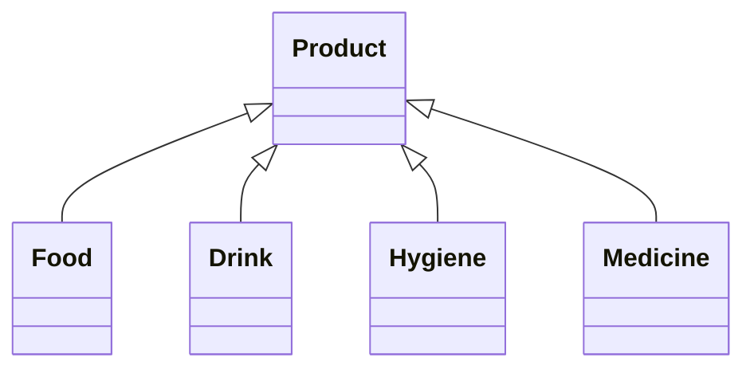

# Convenience Store Inventory System

Sistem untuk tambah entry produk ke dalam inventory, dan menampilkan dalam output.

Dalam runner.cpp, addProduct() menambahkan produk ke dalam Inventory toko.

### Tiap produk memiliki beberapa variable:
```
string name;                  nama produk
string type;                  tipe produk, misal: food, drink, hygiene, etc.
string subtype;               subtipe produk, misal: food, subtipe: instant/snacks/fruits
vector<string> properties;    data tambahan, misal: 100gr, 300kal, expires in 30 days
int price;                    harga produk
int stock;                    stok produk
```

### Dalam runner.cpp, berikut fungsi untuk add produk ke dalam inventory:
```
//FOOD CLASS
addProduct<Food>(Inventory,
    "indomie goreng", "instant",    //name, subtype
    4000, 150,                      //price, stock
    100, 300, 2                     //grams, cal, expire (days)
);
```

### Class terdiri dari:
1. Product: Abstract Class, punya variable dasar nama, subtype, price, dan stock
2. Food: Child Class dari Product, punya atribut weight(gr), calories(kal), expire(days)
3. Drink: Child Class dari Product, punya atribut volume(ml), sugar(gr), expire(days)
4. Hygiene: Child Class dari Product, punya atribut weight/volume(gr/ml), smell(anything)
5. Medicine: Child Class dari Product, punya atribut dose(ml/mg), treats(anything), expire(days)


### Dalam output, seperti ini:
```
                                   [   nama toko yang sangat keren   ]                                      
INVENTORY: 

| no | product name         | price   | stock | category             | properties                                         |
| 1  | indomie goreng       | 2,000   | 150   | food, instant        | 100gr, 300kal, expires in 2 days                   |
| 2  | aqua                 | 5,000   | 30    | drink, water         | 300ml, 0gr, expires in 30 days                     |
| 3  | sampo batman         | 20,000  | 15    | hygiene, shampo      | 200ml, smells like batman                          |
| 4  | panadol merah        | 18,000  | 10    | medicine, kaplet     | 100mg, treats sakit kepala, expires in 365 days    |
```

Untuk tiap addProduct(), satu baris baru akan muncul dalam outputnya.

## Program terdiri atas beberapa file
1. runner.cpp: tempat run program dan penambahan produk ke inventory
2. includes.hpp: berisi #include yang dipakai file lain
3. classes.hpp: tempat class Product dan Inventory
4. functions.hpp: function banyak dipake; print, format uang, dll.
5. interface.hp: mengurus output interface

## Dokumentasi
[Google Drive KPP 1 Internship Abinara-1](https://drive.google.com/drive/folders/1wpiN0y1ybEwYM4VGwzA1PQUx-1dTod0X?usp=sharing)